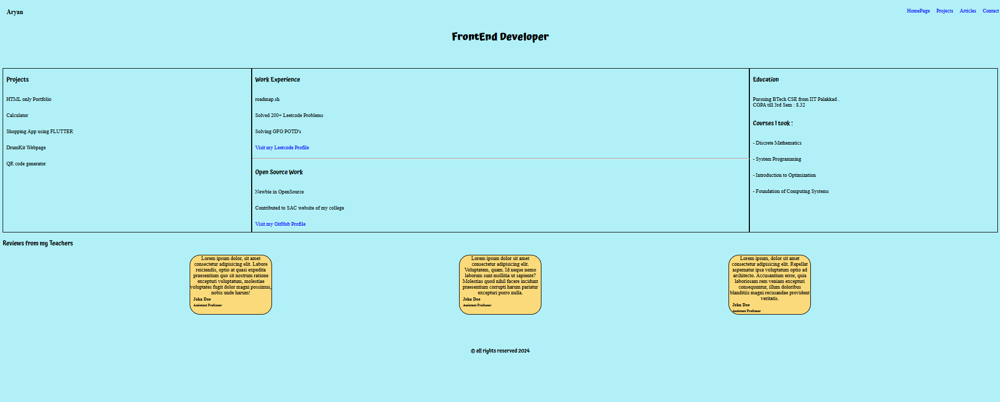

# Goal
Add styles to previous project. Focus on layout and responsive design.

---

## Requirements

- [x] Fully styled and responsive website
- [x] Consistent color scheme and typography
- [x] Use flexbox, media queries, and grid to create a responsive layout
- [x] Responsive navigation bar
- [x] Well-styled contact form

---

## Bonus

- [x] Utilize Google Fonts
- [x] Link to GitHub pages
- [ ] Add dark mode support
